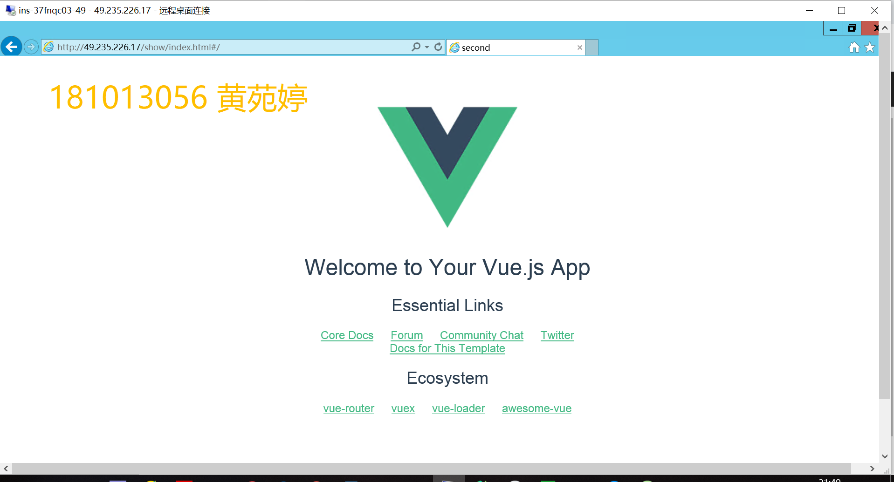
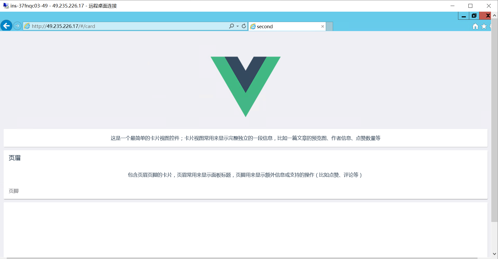
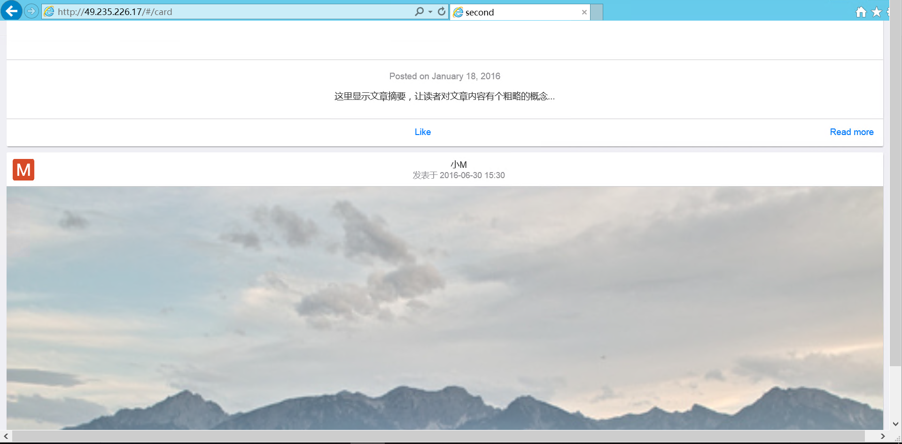
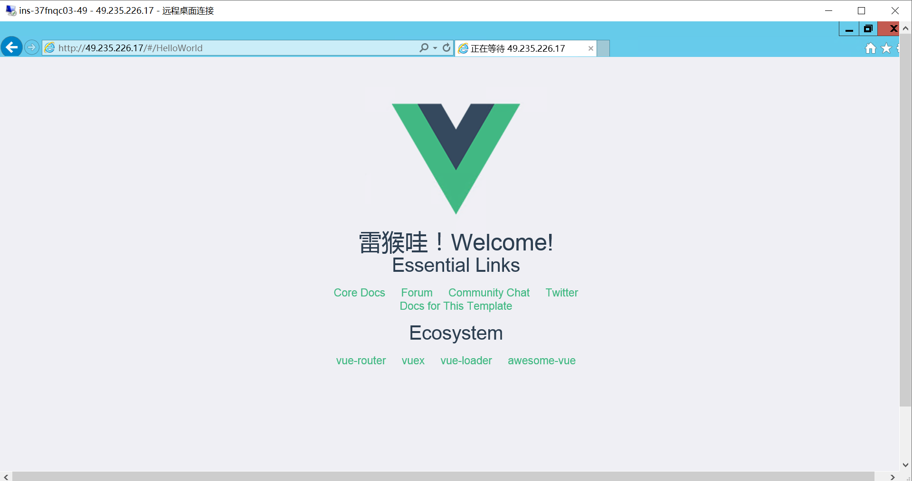
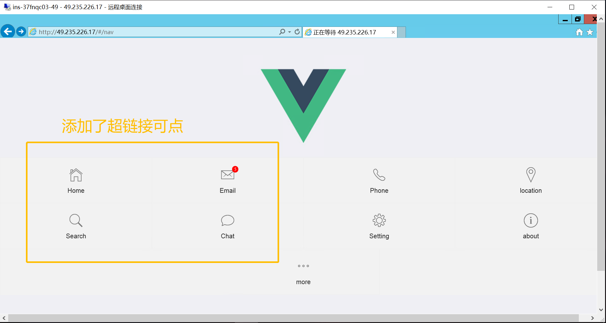
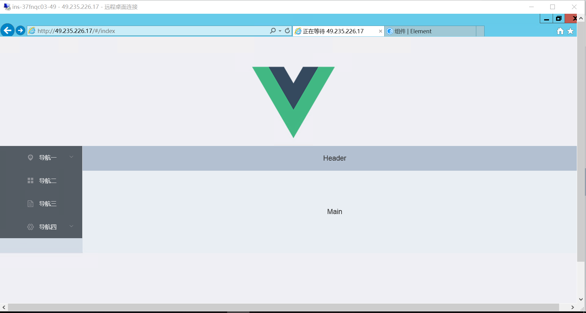

# Front-end-Web
前端开发框架课程期末作业

姓名：黄苑婷

学号：181013056

### 第二题前三项网址

[第二项第一个](http://49.235.226.17/#/card)

[第二项第二个](http://49.235.226.17/#/HelloWorld)

[第二项第三个](http://49.235.226.17/#/nav)

[第三项](http://49.235.226.17/#/index)

### 第二题所有截图

- 第一项：VUE2前端框架搭建

- 第二项：用Mui框架制作单页面组件，并路由实现访问

- 第三项：用Element-ui框架设计基于PC端的网站设计

- 第五项

- 第六项

